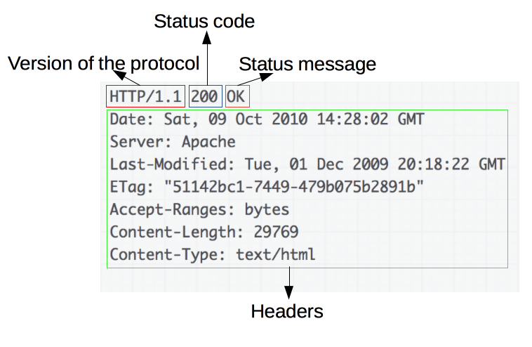

# Конспект "Что такое HTTP"

> [!NOTE]
> Информация взята из следующих источников: 
> - [Видео-курс по HTTP](https://deworker.pro/edu/series/http-basics)
> - [Обзор протокола HTTP](https://developer.mozilla.org/ru/docs/Web/HTTP/Overview)

#
### Обзор HTTP

**HTTP** — это протокол, позволяющий получать различные ресурсы, например HTML-документы. Протокол HTTP лежит в основе обмена данными в Интернете. HTTP является протоколом клиент-серверного взаимодействия, что означает инициирование запросов к серверу самим получателем, обычно веб-браузером (web-browser).

Клиенты и серверы взаимодействуют, обмениваясь одиночными сообщениями (а не потоком данных). Сообщения, отправленные клиентом, обычно веб-браузером, называются *запросами*, а сообщения, отправленные сервером, называются *ответами*.


> HTTP является протоколом прикладного уровня, который чаще всего использует возможности другого протокола - TCP (или TLS - защищённый TCP) - для пересылки своих сообщений, однако любой другой надёжный транспортный протокол теоретически может быть использован для доставки таких сообщений.

#
### Участники обмена HTTP сообщениями
**Участник обмена** *(user agent)* — это любой инструмент или устройство, действующие от лица пользователя. Эту задачу преимущественно выполняет веб-браузер; в некоторых случаях участниками выступают программы, которые используются инженерами и веб-разработчиками для отладки своих приложений.

На другой стороне коммуникационного канала расположен **сервер**, который обслуживает *(англ. serve)* пользователя, предоставляя ему документы по запросу. С точки зрения конечного пользователя, сервер всегда является некой одной виртуальной машиной, полностью или частично генерирующей документ, хотя фактически он может быть группой серверов, между которыми балансируется нагрузка, то есть перераспределяются запросы различных пользователей, либо сложным программным обеспечением, опрашивающим другие компьютеры (такие как кеширующие серверы, серверы баз данных, серверы приложений электронной коммерции и другие).

#
### Шаги взаимодействия клиента с сервером
1. Открытие TCP соединения: TCP-соединение будет использоваться для отправки запроса (или запросов) и получения ответа. Клиент может открыть новое соединение, переиспользовать существующее или открыть несколько TCP-соединений к серверу.
2. Отправка HTTP-сообщения: HTTP-сообщения (до HTTP/2) являются человекочитаемыми. Начиная с HTTP/2, простые сообщения инкапсулируются во фреймы, делая невозможным их чтение напрямую, но принципиально остаются такими же.
    ```http
    GET / HTTP/1.1
    Host: developer.mozilla.org
    Accept-Language: fr
    ```
3. Читает ответ от сервера:
    ```http
    HTTP/1.1 200 OK
    Date: Sat, 09 Oct 2010 14:28:02 GMT
    Server: Apache
    Last-Modified: Tue, 01 Dec 2009 20:18:22 GMT
    ETag: "51142bc1-7449-479b075b2891b"
    Accept-Ranges: bytes
    Content-Length: 29769
    Content-Type: text/html

    <!DOCTYPE html... (here comes the 29769 bytes of the requested web page)
    ```
4. Закрывает или переиспользует соединение для дальнейших запросов.

#
### HTTP Запросы

Запросы содержат следующие элементы:
- HTTP-метод, обычно глагол подобно GET, POST или существительное, как OPTIONS или HEAD, определяющее операцию, которую клиент хочет выполнить. Обычно, клиент хочет получить ресурс (используя GET) или передать значения HTML-формы (используя POST), хотя другие операции могут быть необходимы в других случаях.
- Путь к ресурсу: URL ресурсы лишены элементов, которые очевидны из контекста, например без протокола (http://), домена (здесь developer.mozilla.org), или TCP порта (здесь 80).
- Версию HTTP-протокола.
- Заголовки (опционально), предоставляющие дополнительную информацию для сервера.
- Или тело, для некоторых методов, таких как POST, которое содержит отправленный ресурс.

#
### HTTP Ответы

Ответы содержат следующие элементы:
- Версию HTTP-протокола.
- HTTP код состояния, сообщающий об успешности запроса или причине неудачи.
- Сообщение состояния — краткое описание кода состояния.
- HTTP заголовки, подобно заголовкам в запросах.
- Опционально: тело, содержащее пересылаемый ресурс.

#

[Интернет](../README.md)