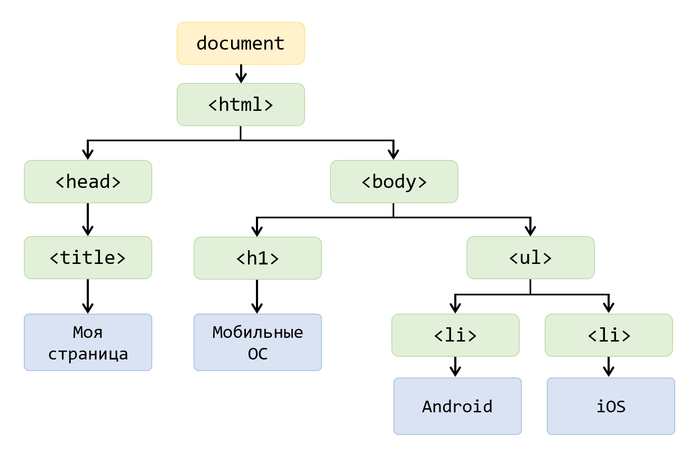
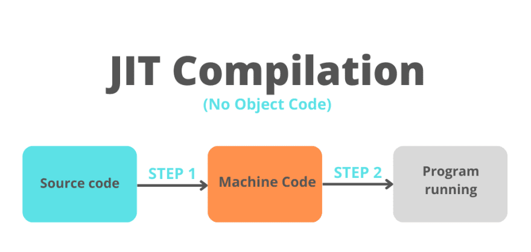
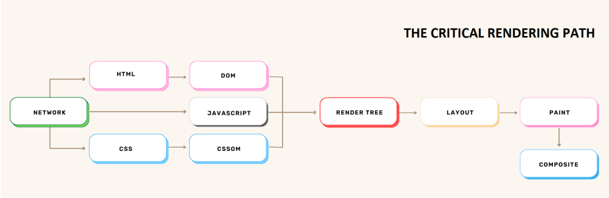

# Конспект "Что такое веб-браузеры и как они работают"

> [!NOTE]
> Информация взята из следующих источников: 
> - [Как работают браузеры](https://web.dev/articles/howbrowserswork?hl=ru)
> - [Как работают браузеры*mdn*](https://developer.mozilla.org/ru/docs/Web/Performance/How_browsers_work)
> - [Браузер*wikipedia*](https://ru.wikipedia.org/wiki/%D0%91%D1%80%D0%B0%D1%83%D0%B7%D0%B5%D1%80)
> - [КАК БРАУЗЕР РЕНДЕРИТ WEB-СТРАНИЦЫ*youtube*](https://www.youtube.com/watch?v=Qz8RfiTum24&ab_channel=Koakoalla)
> - [Как работает веб-браузер*habr*](https://habr.com/ru/articles/726292/)

#
### Браузеры и их функционал
**Браузер, веб-обозреватель или веб-браузер** *(от англ. web browser)* — прикладное программное обеспечение для просмотра страниц, содержания веб-документов, компьютерных файлов и их каталогов; управления веб-приложениями; а также для решения других задач. В глобальной сети браузеры используют для запроса, обработки, манипулирования и отображения содержания веб-сайтов. Многие современные браузеры также могут использоваться для непосредственного просмотра содержания файлов многих графических форматов (`gif`, `jpeg`, `png`, `svg`), аудио- и видеоформатов (`mp3`, `mpeg`), текстовых форматов (`pdf`, `djvu`) и других файлов.

**Основная функция браузера** — представить выбранный вами веб-ресурс, запросив его с сервера и отобразив в окне браузера. Ресурс обычно представляет собой HTML-документ, но также может представлять собой PDF-файл, изображение или какой-либо другой тип контента. Местоположение ресурса указывается пользователем с помощью URI (унифицированного идентификатора ресурса).

#
### Инфраструктура высокого уровня
Основные компоненты браузера:
1. **Пользовательский интерфейс:** включает в себя адресную строку, кнопку «Назад/Вперед», меню закладок и т. д. Все части экрана браузера, кроме окна, в котором вы видите запрошенную страницу.
2. **Механизм браузера:** объединяет действия между пользовательским интерфейсом и механизмом рендеринга.
3. **Механизм рендеринга:** отвечает за отображение запрошенного контента. Например, если запрошенное содержимое представляет собой HTML, механизм рендеринга анализирует HTML и CSS и отображает проанализированное содержимое на экране.
   > Важно отметить, что такие браузеры, как **Chrome**, запускают несколько экземпляров механизма рендеринга: по одному для каждой вкладки. Каждая вкладка выполняется в отдельном процессе.
4. **Сеть:** для сетевых вызовов, таких как HTTP-запросы, используются разные ре ализации для разных платформ за платформо-независимым интерфейсом.
5. **Серверная часть пользовательского интерфейса:** используется для рисования основных виджетов, таких как поля со списком и окна. Этот бэкэнд предоставляет общий интерфейс, не зависящий от платформы. Под ним используются методы пользовательского интерфейса операционной системы.
6. **Интерпретатор JavaScript.** Используется для анализа и выполнения кода JavaScript.
7. **Хранилище данных.** Это уровень персистентности. Браузеру может потребоваться сохранить все виды данных локально, например файлы cookie. Браузеры также поддерживают такие механизмы хранения, как `localStorage`, `IndexedDB`, `WebSQL` и `FileSystem`.

#
### Движки рендеринга
По умолчанию механизм рендеринга может отображать документы и изображения `HTML` и `XML`. Он может отображать другие типы данных через плагины или расширения; например, отображение `PDF`-документов с помощью подключаемого модуля просмотра PDF-файлов.

В разных браузерах используются разные механизмы рендеринга: **Internet Explorer** использует Trident, **Firefox** использует Gecko, **Safari** использует WebKit. **Chrome** и **Opera** (начиная с версии 15) используют Blink, ответвление WebKit.
> WebKit — это механизм рендеринга с открытым исходным кодом, который начинался как движок для платформы Linux и был модифицирован Apple для поддержки Mac и Windows.

#
### Парсинг HTML
После того как браузер получил `HTML`-файл он парсит *(parse - разбирать, анализировать)* его для создания **DOM** *(Document Object Model)*-**дерева**.

### Токенизация
Первый шаг на пути к отображению веб-страницы - это токенизация `HTML`-файла. **Токенизация** - это процесс деления строки символов на значимые **чанки** *(chunk - кусок)* для браузера, именуемые **токенами** *(token - жетон)*.
> Токены являются базовыми строительными блоками DOM-дерева.

### Строительство DOM-дерева
- **Лексинг** *(lexing)* - это процесс конвертации токенов в древовидную структуру именуемую DOM-деревом.
- **DOM-дерево** - это древовидная структура данных, которая представляет собой **ноды** *(node - узел)* в `HTML`-документе.

> Если для страницы требуются какие-либо внешние ресурсы, то они будут обработаны следующим образом:
> 1. Не блокирующие ресурсы загружаются параллельно *(Например: картинки)*
> 1. Отложенные ресурсы загружаются параллельно, но выполняются после того как будет построено DOM-дерево *(Например: скрипты с атрибутом defer и CSS-файлы)*
> 1. Блокирующие ресурсы загружаются и выполняются последовательно *(Например: скрипты БЕЗ атрибута defer)*

### Парсинг CSS
После того как DOM-дерево построено, браузер парсит CSS-файлы для создания **CSSOM** *(CSS Object Model)*.
> Этот процесс аналогичен построению DOM-дерева с использованием токенизации и генерации CSSOM.

### Выполнение JavaScript
Если у страницы есть блокирующий скрипт, то он будет загружен и обработан незамедлительно, в то время как строительство DOM-дерева будет отложено, либо же скрипт будет загружен и выполнен после того, как DOM-дерево будет полностью создано.

Движок JavaScript использует гибридный подход компиляции именуемый **JIT** *(Just in Time - точно в срок)*.
> JIT-компиляция, в отличие от скомпилированного языка такого как C, где компиляция делается заранее *(другими словами **до** выполнения кода)*, делается **во время** выполнения.

### Шаги рендеринга

1. Построение дерева рендера
   
   **Дерево рендера** - это подмножество DOM-дерева, состоящее только из видимых на странице элементов.
2. Компоновка дерева рендера *(layout)*
   
   Она делается путем расчетов точных размеров и позиции каждого элемента в дереве рендера. Этот этап происходит каждый раз, когда мы изменяем что-нибудь в DOM, что затрагивает компоновку страницы, даже частично.
   
   > Примеры ситуаций, когда позиция элементов перерассчитывается:
   > - Добавление или удаление элементов из DOM
   > - Изменение размеров окна браузера
   > - Изменение ширины, высоты или позиции элемента
3. Отрисовка *(painting)*
   
   Браузер решает, какие ноды должны быть видимыми, и рассчитывает их позицию в области просмотра *(viewport)*, после чего наступает время их отрисовать *(сделать рендер пикселей)* на экране. Этот этап также известен как этап растеризации, на котором браузер преобразует каждый элемент, рассчитанный на этапе компоновки, в реальные пиксели на экране. 
   
   > Также как и этап компоновки, этот этап происходит каждый раз когда мы изменяем отображение элемента в DOM, даже частично.
   > Примеры ситуаций, когда происходит повторная отрисовка:
   > - Изменение очертания элемента
   > - Изменение прозрачности (opacity) или видимости (visibility) элемента
   > - Изменение цвета фона элемента
4. Наложение слоев и композиция
   
   Композиция *(compositing)* - это техника разделения частей страницы на слои, их отрисовки и дальнейшего составления из них страницы в отдельном потоке называемом композиторским потоком *(compositor thread)*. Когда разделы документа рисуются в разных слоях, перекрывая друг-друга, композиция необходима для того что бы удостовериться, что они нарисованы в правильном порядке и их содержимое корректно отображается.

#

[Интернет](../README.md)