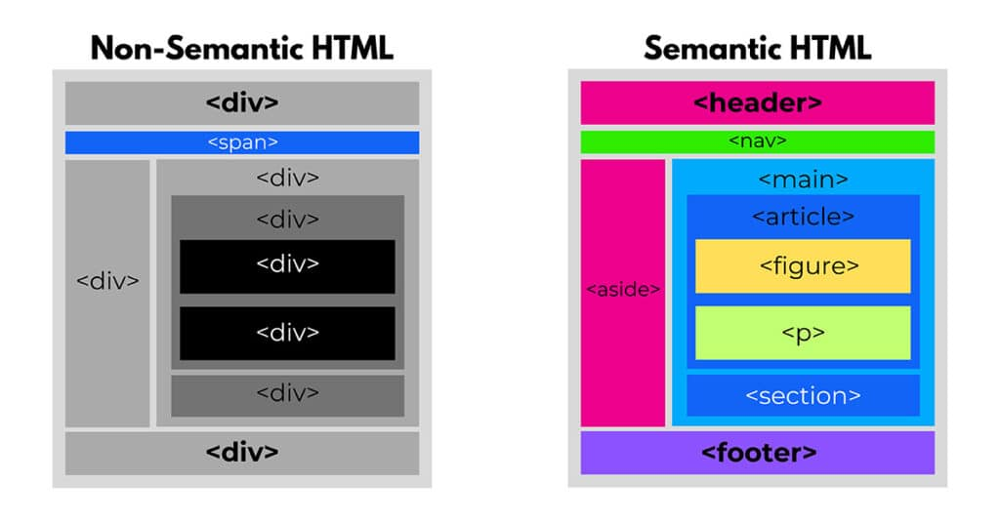

# Семантическая структура страницы
### Различия семантического подхода от **не**семантического

Семантика важна по следующим причинам:
- Для поисковиков
- Для незрячих *(чтобы скринридер давал контекст что читает)*
- Есть стандарты

### Элемент article
Элемент `article` представляет целостный блок информации на странице, который может рассматриваться отдельно и использоваться независимо от других блоков. Например, это может быть пост на форуме или статья в блоге, онлайн-журнале, комментарий пользователя.

[В конексте](./src/article.html)

### Элемент section
Элемент `section` объединяет связанные между собой куски информации html-документа, выполняя их группировку. Например, `section` может включать набор вкладок на странице, новости, объединенные по категории и т.д.

Каждый элемент `section` должен быть идентифицирован с помощью заголовка h1-h6.

При этом элемент `section` может содержать несколько элементов `article`, выполняя их группировку, так и один элемент `article` может содержать несколько элементов `section`.

[В контексте](./src/section.html)

### Элемент nav
Элемент `nav` призван содержать элементы навигации по сайту. Как правило, это ненумерованный список с набором ссылок.

На одной веб-странице можно использовать несколько элементов `nav`. Например, один элемент навигации для **перехода по страницам на сайте**, а другой - для **перехода внутри html-документа**.

> Не все ссылки обязательно помещать в элемент `nav`. Например, некоторые ссылки могут не представлять связанного блока навигации, например, ссылка на главную страницу, на лицензионное соглашение по поводу использования сервиса и подобные ссылки, которые часто помещаются внизу страницы. Как правило, их достаточно определить в элементе `footer`, а элемент `nav` для них использовать необязательно.

[В контексте](./src/nav.html)

### Элементы header, footer и address
#### Header
Элемент `header` является как бы вводным элементом, предваряющим основное содержимое. Здесь могут быть заголовки, элементы навигации или какие-либо другие вспомогательные элементы, например, логотип, форма поиска и т.п. [Смотреть в контексте](./src/header.html)

#### Footer
Элемент `footer` обычно содержит информацию о том, кто автор контента на веб-странице, копирайт, дата публикации, блок ссылок на похожие ресурсы и т.д. Как правило, подобная информация располагается в конце веб-страницы или основного содержимого, однако, `footer` не имеет четкой привязки к позиции и может использоваться в различных местах веб-страницы. [Смотреть в контексте](./src/footer.html)
> Футер необязательно должен быть определен для всей страницы. Это может быть и отдельная секция контента, [как например тут](./src/footer_extended.html)

> [!IMPORTANT]
> Элемент `footer` не следует помещать в такие элементы как `address`, `header` или другой `footer`.

#### Address 
Элемент `address` предназначен для отображения контактной информации, которая связана с ближайшим элементом `article` или `body`. Нередко данный элемент размещается в футере. [Смотреть в контексте](./src/address.html)

### Элемент aside
Элемент `aside` представляет содержимое, которое косвенно связано с остальным контентом веб-станицы и которое может рассматриваться независимо от него. Данный элемент можно использовать, например, для сайдбаров, для рекламных блоков, блоков навигационных элементов, различных плагинов типа твиттера или фейсбука и т.д. [Смотреть в контексте](./src/aside.html)

### Элемент main
Элемент `main` представляет основное содержимое веб-страницы. Он представляет уникальный контент, в который не следует включать повторяющиеся на разных веб-страницах элементы сайдбаров, навигационные ссылки, информацию о копирайте, логотипы и тому подобное. [Смотреть в контексте](./src/main.html)

#

[HTML](../README.md)